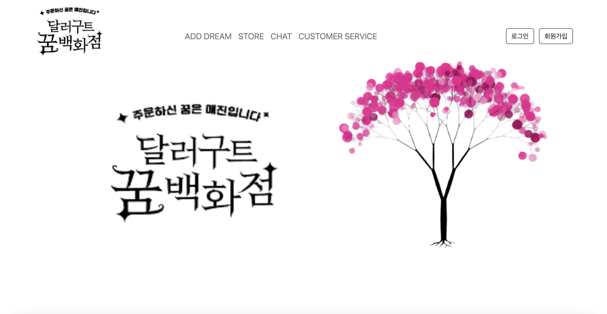

# Final Project
> 두번째 프로젝트 
> STS로 처음 작업해본 프로젝트, 확실히 이클립스로 작업할때보다 훨씬 작업 환경이 편한걸 체감한 프로젝트

포트폴리오 링크 (<>)
 
## 맡은 파트
전반적인 게시판
  
## 개발 환경
1.STS 
2.Apache Tomcat 9.0 
3.SQL Developer 
4.Mybatis 
5.maven
  
## 메인 페이지

  

## 게시판
1. Controller (<https://github.com/YEON-KIM/FinalPrj/blob/main/workspace/FinalPrj/src/main/java/com/dds/app/board/controller/BoardController.java>)
2. Service (<https://github.com/YEON-KIM/FinalPrj/blob/main/workspace/FinalPrj/src/main/java/com/dds/app/board/service/BoardService.java>)
3. Dao (<https://github.com/YEON-KIM/FinalPrj/blob/main/workspace/FinalPrj/src/main/java/com/dds/app/board/dao/BoardDao.java>)
4. Vo (<https://github.com/YEON-KIM/FinalPrj/blob/main/workspace/FinalPrj/src/main/java/com/dds/app/board/vo/BoardVo.java>)
5. Mapper (<https://github.com/YEON-KIM/FinalPrj/blob/main/workspace/FinalPrj/src/main/resources/mybatis/mapper/board-mapper.xml>)

  

## 댓글 기능
1. Controller (<https://github.com/YEON-KIM/FinalPrj/blob/main/workspace/FinalPrj/src/main/java/com/dds/app/board/reply/controller/ReplyController.java>)
2. Service (<https://github.com/YEON-KIM/FinalPrj/blob/main/workspace/FinalPrj/src/main/java/com/dds/app/board/reply/service/ReplyService.java>)
3. Dao (<https://github.com/YEON-KIM/FinalPrj/blob/main/workspace/FinalPrj/src/main/java/com/dds/app/board/reply/dao/ReplyDao.java>)
4. Vo (<https://github.com/YEON-KIM/FinalPrj/blob/main/workspace/FinalPrj/src/main/java/com/dds/app/board/reply/vo/ReplyVo.java>)
5. Mapper (<https://github.com/YEON-KIM/FinalPrj/blob/main/workspace/FinalPrj/src/main/resources/mybatis/mapper/reply-mapper.xml>)

  

